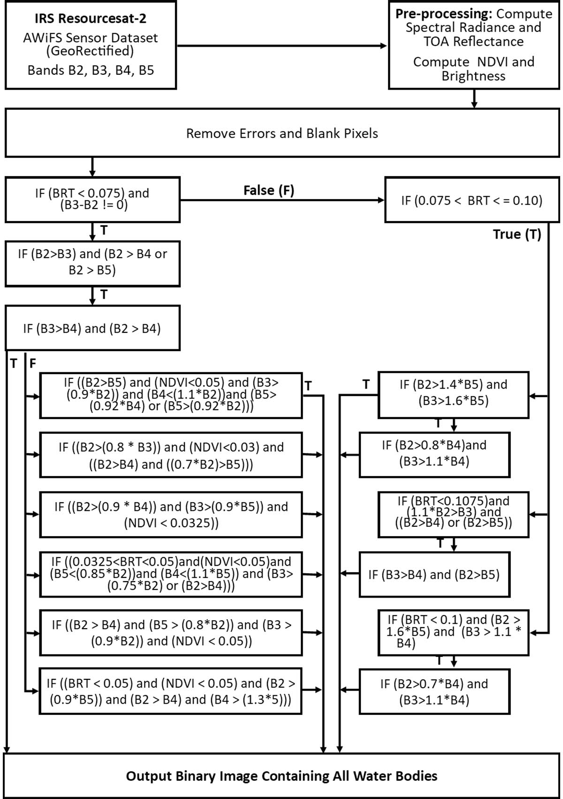
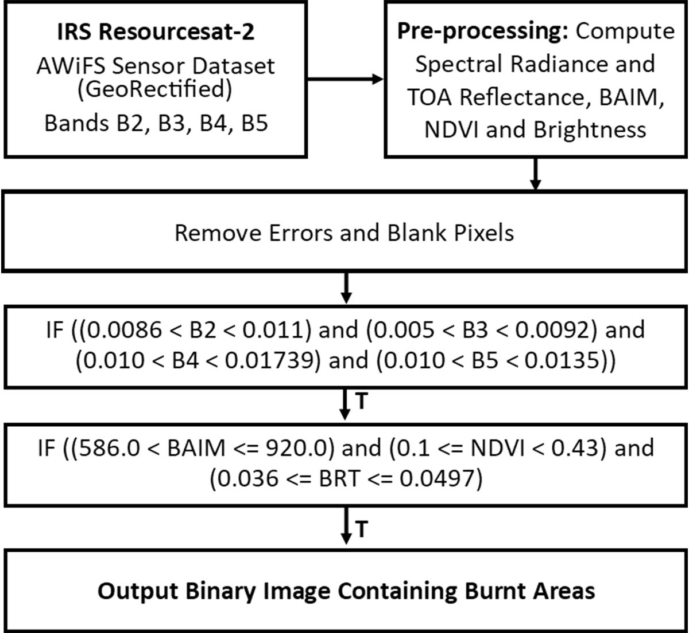
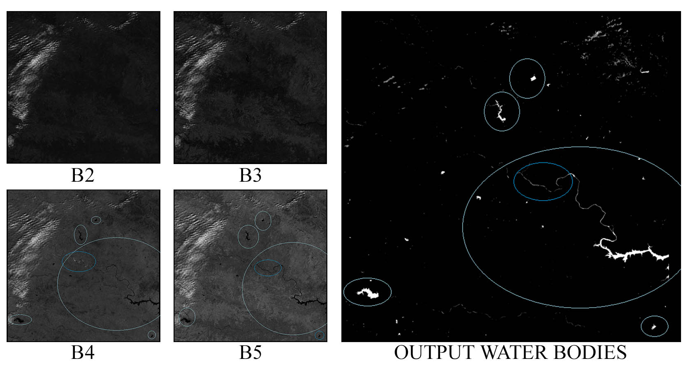
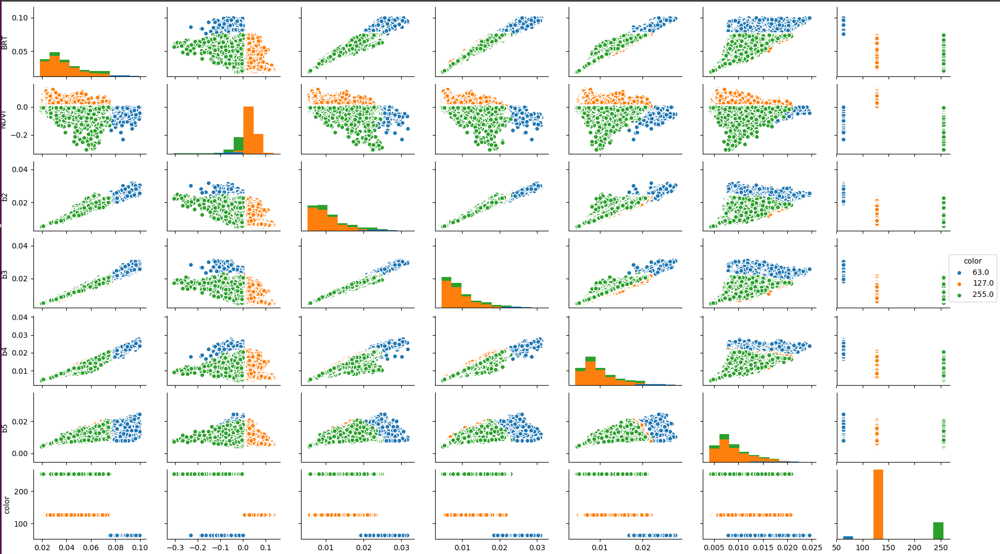
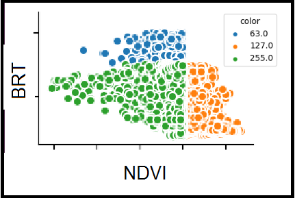

# Dynamic Semantic Segmentation (DSS) of Water Bodies and Burnt Areas from AWiFS Images

This project is an implementation of the DSS algorithm proposed in our paper [Content Based Image Retrieval from AWiFS Images Repository of IRS Resourcesat-2 Satellite Based on Water Bodies and Burnt Areas](https://arxiv.org/abs/1809.10190).

## Abstract
Satellite Remote Sensing Technology is becoming a major milestone in the prediction of weather anomalies, natural disasters as well as finding alternative resources in proximity using multiple multi-spectral sensors emitting electromagnetic waves at distinct wavelengths. Hence, it is imperative to extract water bodies and burnt areas from orthorectified tiles and correspondingly rank them using similarity measures. Different objects in all the spheres of the earth have the inherent capability of absorbing electromagnetic waves of distant wavelengths. This creates various unique masks in terms of reflectance on the receptor. We propose Dynamic Semantic Segmentation (DSS) algorithms that utilized the mentioned capability to extract and rank Advanced Wide Field Sensor (AWiFS) images according to various features. This system stores data intelligently in the form of a sparse feature vector which drastically mitigates the computational and spatial costs incurred for further analysis. The compressed source image is divided into chunks and stored in the database for quicker retrieval. This work is intended to utilize readily available and cost effective resources like AWiFS dataset instead of depending on advanced technologies like Moderate Resolution Imaging Spectroradiometer (MODIS) for data which is scarce.

## The DSS Algorithm

For finding Water Bodies   |  For finding Burnt Areas
:-------------------------:|:-------------------------:
  |  

## Results

Water Bodies   |  Burnt Areas
:-------------------------:|:-------------------------:
  |  

## Features Visualization

Overall   |  BRT vs NDVI
:-------------------------:|:-------------------------:
  |  

## Usage

Find water bodies and burnt areas, store spare vectors in MongoDB:
```bash
$ python hawkeye_core.py /path/to/Dataset/
```
Calculate similarity with a particular orthorectified tile:
```bash
$ python Similarity_linted.py /path/to/tileImage/
```
